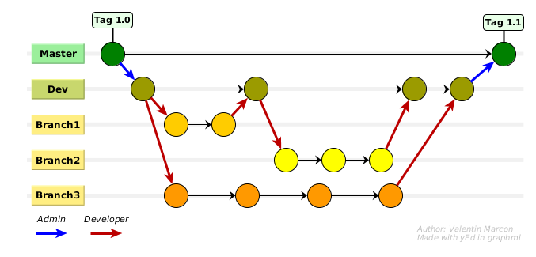

# GFLS (Galaxy For Life Science)  :heavy_minus_sign::sparkles::sparkles::four::herb::microscope::heavy_minus_sign: BIOS4BIOL

##  :bar_chart: GFLS_Stats_Explorer :

This repository concern the **GFLS_Stats_Explorer** part of the GFLS project.
It is made in collaboration with the **statistics group of the CATI "BIOS4BIOL"**.
All the **R**, **Perl** and **XML** scripts are made by this team.

* __There is 3+1 tool on this project :__
  - **summary_statistics** : This tool produces simple descriptive statistics from a numeric table. Statistical measures are computed for each column in the table. *@contact melanie.petera[a]inra.fr*
  - **h_clust** : This tool allows to generate hierarchical cluster analysis on a numeric data table according to differents parameters. *@contact luc.jouneau[a]inra.fr*
  - **pcaFactoMineR** This tool launch a Principal Component Analysis (PCA) as done in the FactoMineR package *@contact laguerre[a]insa-toulouse.fr*
  - **normalization** : This last one (the +1) was made during the GFLS project after an enhancement discussion of the differents tools with the stats group. It propose the user different normalization method to preprocess data tables (in tabular format). *@contact luc.jouneau[a]inra.fr*

* __The aim of the GFLS project is to :__
  - **Enhance the wrappers** of this tools
  - **Package** their dependencies
  - Make them at disposition of everyone into different **instances** (Galaxy servers, Cloud)

- __Other Contacts :__
  - Manager of the GFLS project : *olivier.inizan[a]inra.fr*
  - Manager of the GFLS_Stats_Explorer *project : sarah.maman[a]inra.fr*
  - Developper for the GFLS project : *valentin.marcon[a]inra.fr*

- __(:exclamation:UPDATE 05/12/17) Toolshed repository :__
  - **summary_statistics** : [Test Toolshed (05/12/17)](https://testtoolshed.g2.bx.psu.edu/repository?repository_id=1108a93855a8316d&changeset_revision=4da9d07e7225)
  - **h_clust** : [Test Toolshed (05/12/17)](https://testtoolshed.g2.bx.psu.edu/repository?repository_id=0d3021e65aabd13b&changeset_revision=663d1783595d)
  - **pcaFactoMineR** [Test Toolshed (05/12/17)](https://testtoolshed.g2.bx.psu.edu/repository?repository_id=03e370a4163dc21f&changeset_revision=641fe38db118)
  - **normalization** : [Test Toolshed (05/12/17)](https://testtoolshed.g2.bx.psu.edu/repository?repository_id=5b7283f43927994c&changeset_revision=b9c53156ff72)
  
##  :computer: Dev processus :

To work on this project you need to clone it (html or ssh way)

<code> git clone https://github.com/IFB-ElixirFr/GFLS.git # With html</code>

<code> git clone git@github.com:IFB-ElixirFr/GFLS.git     # With SSH</code>

<code> git fetch origin dev:dev # Get the "dev" branch</code>

#### Then, you will need to **follow the Versionning strategy** as descibed bellow :

-  **To make a change on a file, you need to create your own branch of developement ("Branch X"), based on the "Master" one.**

<code> git checkout master           # Change branch to Master</code>

<code> git pull origin master        # Recover the last changes</code>

<code> git checkout -b branchMyName  # Create a new branch named "branchMyNale" from the Master branch</code>

**or update your branch**

<code> git checkout branchMyName      # Change branch to your own </code>

<code> git pull origin master:master # Recover the last changes from Master</code>

-  **Make your developement on your branch, and then commit and push to your branch**

<code> git commit -a -m "YourMessage" # Record changes to the repository</code>

<code> git pull origin branchYourName # EXCEPTIONAL : If another member use it to develop (or if you use several developement environment), recover the last changes in your branch </code>

<code> git push origin branchYourName # Push to the dev branch</code>

-  **Merge with the "Dev" branch**

<code> git checkout dev       # Change branch to Dev</code>

<code> git pull origin dev    # Recover the last changes from Dev</code>

<code> git merge branchMyName # Merge your change with the dev branch</code>

-  **If it's ok, push on the remote dev branch**

<code> git push origin dev            # Push to the dev branch</code>

-  : **Inform the administrator, and ask him to make the test with the dev branch if you are not able to**
-  **Finally if the developement work, the administrator will push on the master branch**
-  **The adminstrator will create a "tag" to the master node, corresponding to the new release of the project**

 Developer  Admin

